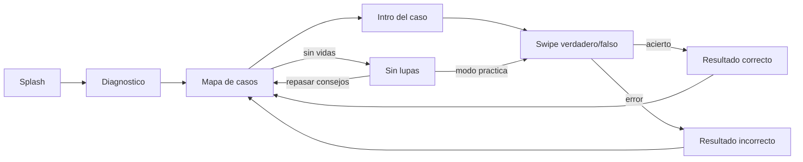
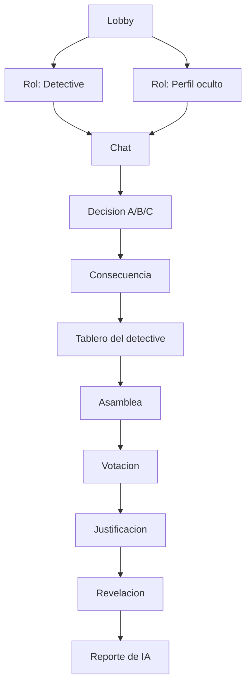

# Funcionalidad — Lupo

> Este documento describe **cómo funciona la app hoy**, a nivel de flujo
> de usuario. Para la lista completa de historias de usuario y su
> criterio de aceptación ver `HU-BACKLOG.md`; para el cruce pantalla por
> pantalla (mockup vs. implementado) ver `SCREEN-STATUS.md`. No se
> duplica esa información aquí, solo se explica cómo encajan las piezas.

Lupo tiene dos modos de juego independientes que comparten cuenta,
progreso y sistema de idiomas, más un hub de misiones que los conecta.

## 1. Modo individual — "sendero de casos"

Pensado para partidas cortas, solas, en cualquier momento del día.

- **Diagnóstico** (`25Diagnostic.tsx`): 3 casos sin puntaje ni vidas,
  saltable, define el nivel inicial.
- **Mapa** (`02Map.tsx` + `components/MapPath.tsx`): sendero visual de
  casos, con curva Bézier dibujada en SVG entre nodos; el nodo activo
  abre el caso individual.
- **Caso** (`26CaseIntro.tsx` → `27Swipe.tsx`): el jugador desliza o toca
  para decidir si el contenido es real o falso.
- **Resultado** (`28ResultCorrect.tsx` / `29ResultWrong.tsx`): siempre
  hay explicación, sea acierto o error (HU-15).
- **Sin lupas** (`03NoLives.tsx`): al quedarse sin vidas, dos salidas
  gratuitas — repasar consejos o entrar en modo práctica — nunca un muro
  duro (HU-23).

Progreso persistido: `casesSolved`, `casesAttempted`, `hearts`, `pp`,
`streak` (`state/store.ts`).

## 2. Modo multijugador — "¿Quién está detrás?"

Partida de sala (3 a 10 jugadores) con un perfil oculto guiado por el
sistema entre los participantes.

- **Lobby** (`04Lobby.tsx`): sala con código, mínimo 3 jugadores (HU-07).
- **Roles** (`05RoleDetective.tsx`, `06RoleHidden.tsx`): el perfil oculto
  elige solo entre conductas prediseñadas por el sistema, nunca texto
  libre (HU-09).
- **Chat** (`07Chat.tsx`): preguntas predeterminadas por fase, no chat
  libre (HU-10).
- **Decisión / Consecuencia** (`08Decision.tsx`, `09Consequence.tsx`):
  decisión A/B/C con patrón confianza → información → secreto → presión
  → riesgo.
- **Tablero** (`10Board.tsx`): 7 tipos de señal marcables
  (`BOARD_SIGNAL_KEYS` en el store), privado hasta la asamblea (HU-11).
- **Asamblea / Votación** (`11Assembly.tsx`, `12Vote.tsx`): turnos y voto
  secreto (HU-12).
- **Justificación** (`13Justification.tsx`): puntaje +40/+30/+20/+30 por
  señal justificada, recalculado en vivo (`justScore()` en el store,
  HU-13). El orden de puntaje en pantalla no sigue el orden `j1..j4` —
  está documentado explícitamente en `JUSTIFICATION_ITEMS` porque así lo
  define el mockup fuente.
- **Revelación / Reporte** (`14Reveal.tsx`, `15Report.tsx`): siempre
  aparecen los cuatro pasos — para, bloquea, reporta, cuéntaselo a un
  adulto (HU-14) — y un reporte personalizado generado por el "Game
  Master" de IA.

## 3. Misiones de contenido (2, 3 y 4)

Retos individuales de un solo caso, desbloqueados progresivamente desde
el hub de Misiones (`16Missions.tsx`), cada uno con su propia mecánica:

| Misión | Mecánica | Pantallas | Historia |
|---|---|---|---|
| Misión 2 | Marcar zonas de una imagen que delatan contenido generado por IA (incluye una zona señuelo, `z4`, que no cuenta para el puntaje) | `18Mission2Evidence.tsx`, `19Mission2Result.tsx` | HU-16 |
| Misión 3 | Redactar una publicación antes de subirla, detectando qué datos revela sin querer | `20Mission3Redact.tsx`, `21Mission3Verdict.tsx` | HU-17 |
| Misión 4 | Verificar una noticia con una lista de 5 comprobaciones antes de decidir si reenviarla | `22Mission4Evidence.tsx`, `23Mission4Verification.tsx`, `24Mission4Result.tsx` | HU-18 |

Misión 4 se desbloquea solo cuando `mission3Stars > 0` — reemplazó un
candado que antes no tenía ninguna llave real (ver
`IMPROVEMENT-BACKLOG.md`, punto 5).

## 4. Sistemas transversales

- **Onboarding / intro** (`00Intro.tsx`): video animado que se reproduce
  una sola vez en el primer lanzamiento; se persiste `hasSeenIntro` para
  no repetirlo. Repetible manualmente desde Perfil ("volver a ver la
  intro").
- **Autenticación ligera** (`33Login.tsx`, `34Register.tsx`,
  `navigation/gates.ts`): no hay backend de auth real — es un flag local
  (`isAuthenticated`) que solo se exige para entrar a Ligas o Torneo
  (HU-05). `openGatedScreen()` centraliza esa regla para no duplicarla
  pantalla por pantalla.
- **Ligas y torneo** (`30Leagues.tsx`, `17Tournament.tsx`): pantallas
  construidas, sin backend de ranking real detrás todavía.
- **Perfil** (`31Profile.tsx`): estadísticas e insignias derivadas de
  datos reales del store (nunca decorativas), ajustes de modo sénior,
  alto contraste y recordatorios.
- **Accesibilidad**: modo sénior (`seniorMode` + `theme/useFontScale.ts`)
  aplica texto más grande en pantallas de lectura de evidencia en vez de
  duplicar cada pantalla en una versión aparte (HU-03).

## Qué falta (resumen)

La lista completa y priorizada vive en `HU-BACKLOG.md` (sección "Matriz
de casos límite") y en `IMPROVEMENT-BACKLOG.md`. A alto nivel, sin
implementar todavía:

- Rol docente y comparación antes/después de un grupo (HU-06, HU-26).
- Editor de contenido para cargar casos reales con fuente verificada
  (HU-19).
- Modo práctica que no gasta vidas ni racha (HU-20).
- Los tres puntos bloqueantes de seguridad del menor (reporte entre
  jugadores, pedir ayuda real, consentimiento/datos de menores).
- Backend real para ligas, torneo y cuentas (hoy todo es local con
  AsyncStorage vía Zustand `persist`).
