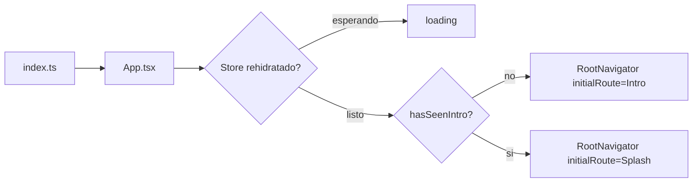

# Arquitectura técnica — Lupo

## Stack

- **Expo SDK 57**, React Native 0.86.2, React 19.2.3, TypeScript 6.
- Navegación: **React Navigation** (`@react-navigation/native-stack`),
  un único stack sin headers nativos (`headerShown: false` global —
  cada pantalla dibuja su propio header si lo necesita).
- Estado global: **Zustand** con middleware `persist` sobre
  `AsyncStorage`.
- Estilos: hojas de estilo React Native planas por pantalla/componente,
  sin librería de UI externa. Iconos vía `lucide-react-native`.
- Gráficos vectoriales: `react-native-svg` (mapa de progreso, mascotas
  animadas).
- Video: `expo-video` (clips de intro).

No hay backend propio: toda la app corre sobre estado local persistido
en el dispositivo. No hay llamadas de red a un servidor propio en el
código actual (ver `02-funcionalidad.md`, sección "Qué falta", para lo
que eso implica en ligas/torneo/cuentas).

## Estructura de carpetas (`mobile/src`)

```
src/
  components/     componentes de UI reutilizables (Button, Card, Avatar,
                  BottomNav, MapPath, Mascot, ...)
  components/mascot/  sistema de mascota animada (ver más abajo)
  data/           datos estáticos (ej. jugadores de ejemplo)
  i18n/           diccionario de traducciones + hook useT()
  navigation/     stack, tipos de rutas, reglas de acceso (gates)
  screens/        una pantalla por archivo, numeradas según el mockup
                  fuente (00Intro .. 34Register)
  state/          store global (Zustand)
  theme/          colores, tipografía, hook de escala de fuente
```

Las pantallas están numeradas siguiendo la numeración del mockup HTML
original (`project/Lupo - Cazadores de Fakes.dc.html` /
`Lupo v4 - Rebranding.dc.html`), no el orden real de navegación — por
eso el stack en `RootNavigator.tsx` no sigue el orden numérico de los
archivos.

## Flujo de arranque



`App.tsx` espera a que Zustand `persist` termine de rehidratar desde
`AsyncStorage` antes de decidir la ruta inicial. Sin ese guard, la
hidratación asíncrona haría que la intro se repita en cada arranque
(quedó documentado como bug corregido en el commit que introdujo la
intro).

## Estado global (`state/store.ts`)

Un único store Zustand (`useGameStore`) para todo: progreso de juego
(vidas, puntos, racha), respuestas de cada mecánica (tablero, votos,
justificación, zonas, redacción, checks), estrellas por misión,
preferencias de accesibilidad, sesión (`isAuthenticated`) e idioma.

Solo un subconjunto se persiste (`partialize`) — lo que debe sobrevivir
a un reinicio de la app: idioma, vidas, puntos, racha, estrellas de
misión, progreso de casos, ajustes de accesibilidad, `hasSeenIntro` y
sesión. El estado transitorio de una partida en curso (tablero, voto,
justificación, zonas, redacción, checks) **no** se persiste — se resetea
con funciones `resetPartyGame` / `resetMission2` / `resetMission3` /
`resetMission4` al empezar cada intento.

## Internacionalización

`src/i18n/dict.ts` define un diccionario estático por idioma
(`es`/`en`/`pt`/`fr`, tipo `LangCode`) — no usa `i18next` ni ninguna
librería de i18n; es un objeto `DICT[lang]` indexado directamente. El
hook `useT()` lee el idioma actual del store y devuelve el diccionario
correspondiente; cambiar de idioma es un `set({ lang })` normal, así que
toda la UI se re-renderiza en el nuevo idioma sin recargar.

## Sistema de mascota animada

Introducido en el commit `db4b693` ("Add animated SVG mascots..."). Las
mascotas (búho y perro, 4 estados de ánimo cada uno) se dibujan a partir
de 8 SVG fuente (`assets/mascotas/*.svg`) donde cada parte del cuerpo
está etiquetada. `scripts/gen-mascot-data.js` parsea esos SVG en un árbol
de nodos tipado (`components/mascot/mascotData.ts`), y
`components/mascot/MascotSvg.tsx` anima cada parte por separado (alas,
brazos, orejas, cola, cabeza, cresta, parpadeo), en loops con periodos
deliberadamente distintos para que no queden sincronizados entre sí. El
parpadeo anima directamente la propiedad `ry` del ojo (no una escala de
grupo) porque eso funciona igual en nativo y en web.

## Theming y accesibilidad

- `theme/colors.ts`, `theme/typography.ts`: paleta y tipografía
  centralizadas.
- `theme/useFontScale.ts`: hook que multiplica el tamaño de fuente
  cuando `seniorMode` está activo, usado en pantallas de lectura de
  evidencia en vez de duplicar pantallas.

## Build y distribución

Ver `04-integraciones.md` y `05-workflow-cicd.md` para cómo este código
se compila y se despliega — resumen rápido: `app.json` + `eas.json`
definen tres perfiles de build (`development`, `preview`, `production`)
sobre **EAS Build**, con `production` empaquetando un `.aab` que se
somete automáticamente a Google Play vía **EAS Submit**.
