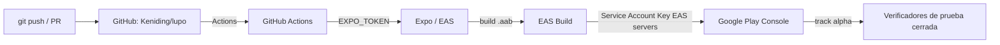

# Integraciones — Lupo

## Resumen



## Expo / EAS

- **Cuenta**: `keniding` (owner del proyecto en expo.dev).
- **Proyecto**: `lupo`, `projectId` en `app.json` →
  `extra.eas.projectId = aaaf3c1f-d91d-4112-aee2-bea978ea6f72`. Este id
  se generó de nuevo (commit `7843a53` → `3c449fe`) porque el original
  quedó atado al slug antiguo `mobile`, incompatible con el slug actual
  `lupo`.
- **Perfiles de build** (`mobile/eas.json`):
  - `development`: cliente de desarrollo, distribución interna, `.apk`.
  - `preview`: distribución interna, `.apk`.
  - `production`: `.aab`, `autoIncrement: true` (el `versionCode` de
    Android sube solo en cada build).
- **Perfiles de submit** (`mobile/eas.json`):
  - `production` → track **alpha** de Google Play (== "Prueba cerrada"
    en la interfaz en español de Play Console — mismo track, dos
    nombres).
  - `internal` → track **internal** de Google Play.
- **Credenciales**: el keystore de firma de Android y la Service Account
  Key de Google están guardadas **del lado de los servidores de EAS**
  (`eas credentials`), no en el repo ni en GitHub Actions. Un build
  reporta esto explícitamente en su log:
  ```
  Google Service Account Key already set up.
      Key Source   :  EAS servers
      Account Email:  eas-submit-lupo@lupo-505302.iam.gserviceaccount.com
  ```
  Esto significa que `eas submit` (local o en CI) nunca necesita leer un
  archivo de credenciales del filesystem — solo necesita autenticarse
  contra Expo con un token de cuenta.
- **Autenticación de CLI**: `eas-cli` se autentica con un usuario
  (`eas login`, sesión local) o con un **Personal/Robot Access Token**
  (`EXPO_TOKEN`, usado por GitHub Actions — ver `05-workflow-cicd.md`).
  Los tokens se gestionan en
  `https://expo.dev/accounts/keniding/settings/access-tokens` — no hay
  comando de `eas-cli` para listarlos ni ver su origen, solo el
  dashboard web.

## Google Play Console

- **App**: Lupo, paquete `com.keniding.lupo`.
- **Tracks en uso**:
  - **Interna** (`internal`): hasta 100 verificadores internos.
  - **Prueba cerrada / alpha**: donde llegan los builds de `production`
    vía `eas submit`.
  - **Producción**: inactiva. Para solicitarla, Google exige haber
    corrido la prueba cerrada con **mínimo 12 verificadores** durante
    **al menos 14 días**. A la fecha de este documento hay 2
    verificadores aceptados — es un requisito de política de Google, no
    algo que un build o un deploy puedan saltarse.

## Archivo `gcp/*.json` (local, ignorado por git)

El repo tiene una carpeta `gcp/` (raíz del repo, fuera de `mobile/`) con
una Service Account Key de Google Cloud en JSON
(`gcp/lupo-505302-*.json`), ignorada explícitamente en `.gitignore`
(commit `f30fde4`). Es la copia local que se usó **una vez** para
configurar la credencial de submit en `eas credentials` (ver arriba).
No se usa en cada build, no se sube a GitHub, y no debe agregarse como
secret de GitHub Actions — la credencial que realmente usa el pipeline
ya vive en los servidores de EAS.

## GitHub

- **Repositorio**: `Keniding/lupo`, rama por defecto `main`.
- **Ruleset de rama**: `main-protection` (activo) sobre `main` — ver
  `05-workflow-cicd.md` para el detalle de reglas.
- **Secrets de Actions**: `EXPO_TOKEN` (repository secret), usado por
  `expo/expo-github-action` para autenticar `eas-cli` en los workflows.
- **Colaboradores**: al menos un colaborador externo activo
  (`luisenriowo`), además del owner (`keniding`).
