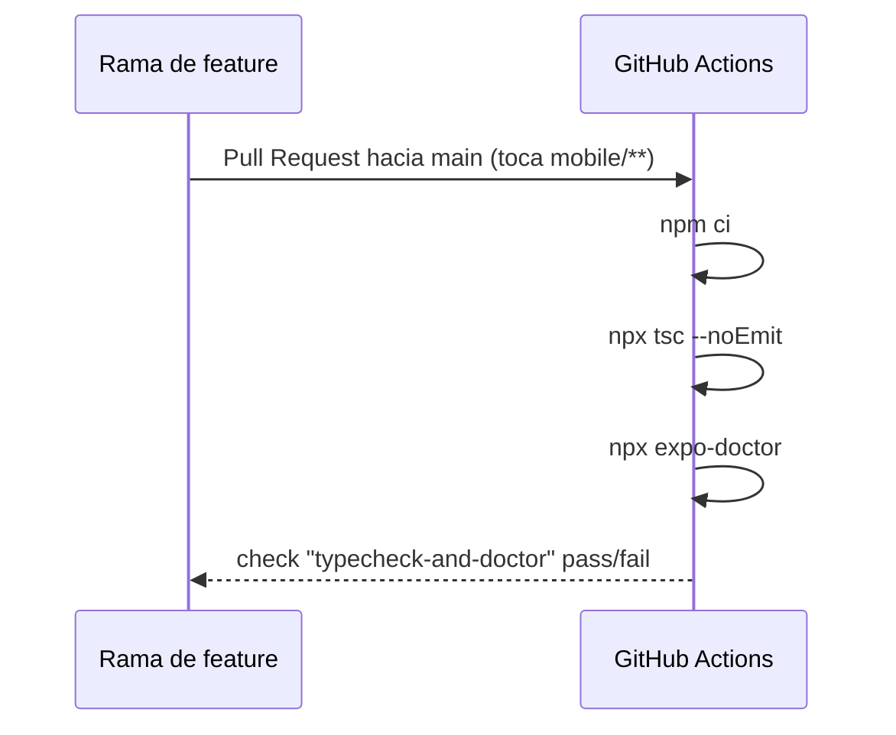
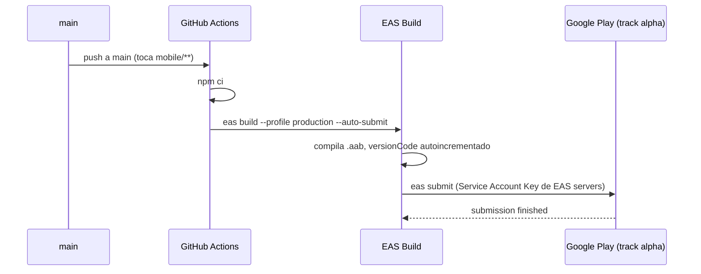
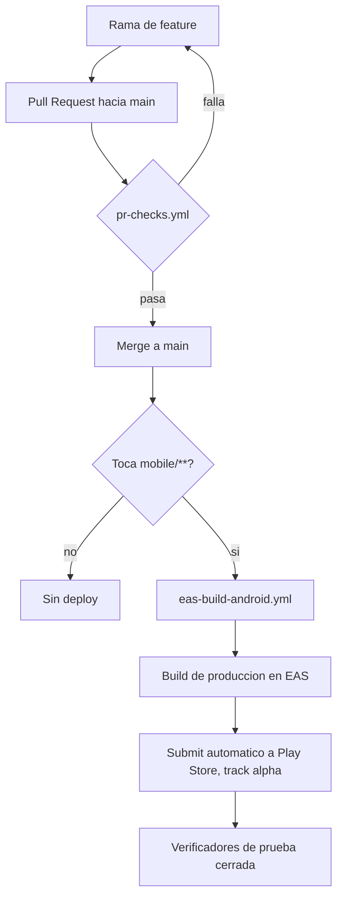

# Workflow de Git y CI/CD — Lupo

## Modelo de ramas

- `main` es la rama protegida y la única fuente de verdad para producción.
- Todo cambio entra por rama de feature/fix + Pull Request — no hay push
  directo a `main` salvo bypass explícito del owner (ver ruleset abajo).
- Convención de nombres usada hasta ahora: `claude/<tema>` para trabajo
  asistido por agentes, `ci/<tema>` para cambios de pipeline,
  `test/<tema>` para verificaciones puntuales del pipeline.

## Ruleset de protección de `main`

Configurado en GitHub → Settings → Rulesets → `main-protection` (activo,
rama objetivo: `main`, la rama por defecto).

Reglas activas:

- **Require a pull request before merging** — nadie hace push directo a
  `main`; todo pasa por PR. `Required approvals` en 0 mientras el
  proyecto tenga un solo desarrollador activo revisando — subir a 1+ en
  cuanto haya un segundo colaborador real disponible para aprobar.
- **Block force pushes** — nadie reescribe el historial de `main`.
- **Restrict deletions** — nadie borra la rama.

Bypass list: el owner (`Keniding`) con "Always allow" — puede seguir
haciendo push directo o mergear sin aprobación en una emergencia. Esto
implica que el ruleset **no restringe al owner**, solo a otros
colaboradores; es la razón por la que probar el ruleset empujando
directo como owner no sirve como prueba real de bloqueo.

Deliberadamente **no** activado todavía: `Restrict updates` (redundante
con "Require pull request" y puede interferir con merges normales),
`Require linear history`, `Require signed commits`, code
scanning/quality/coverage (requieren herramientas no configuradas
todavía).

## Pipelines de GitHub Actions

Dos workflows, ambos en `.github/workflows/` (raíz del repo, no dentro
de `mobile/`), ambos con `paths: mobile/**` — solo se disparan si el
cambio toca la app.

### `pr-checks.yml` — validación en cada Pull Request

Corre `tsc --noEmit` (typecheck) y `expo-doctor` (valida que las
versiones de paquetes instaladas coincidan con lo que espera el SDK de
Expo declarado, entre otras 20 verificaciones). Pensado para marcarse
como *required status check* del ruleset una vez que el equipo lo
considere estable.

### `eas-build-android.yml` — build + submit a Play Store

Se dispara con cada push a `main` que toque `mobile/**` — en la práctica,
cada Pull Request mergeado que cambie código de la app. Corre
`eas build --platform android --profile production --non-interactive
--auto-submit`: compila y, sin intervención humana, somete el resultado
al track alpha de Google Play. También se puede lanzar a mano desde la
pestaña Actions (`workflow_dispatch`).

Requiere el secret `EXPO_TOKEN` en el repo (ver `04-integraciones.md`)
para que `eas-cli` pueda autenticarse sin un login interactivo.

## Ciclo de vida de un cambio, de punta a punta

## Notas operativas

- El primer intento de build tras un merge grande falló porque
  `node_modules` local no tenía instalada una dependencia nueva
  (`expo-video`) que sí estaba en `package.json`/`package-lock.json` —
  recordatorio de correr `npm install` después de traer cambios de otra
  rama, no asumir que el lockfile actualizado ya implica paquetes
  instalados.
- `expo-doctor` puede fallar un build por desalineación de versiones de
  paquetes con el SDK declarado aunque el código compile — no es un
  error de sintaxis, es una validación de compatibilidad. Se corrige con
  `npx expo install --fix`.
- Reusar el mismo `.aab` (mismo `versionCode`) para subirlo manualmente
  a un track donde `eas submit` ya lo subió falla en Play Console con
  "Ya se usó el código de la versión N" — no es un error, es la
  confirmación de que ya está ahí.
